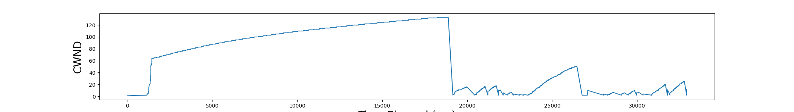

## TCP

TCP Server-Client implementation with C socket programming. The congestion control protocol is similar to that of TCP Tahae, which includes the following:

-   Slow Start
-   Congestion Avoidance
-   Fast Retransmit

The program was tested by artificially applying packet delays and packet losses with [Mahimahi](http://mahimahi.mit.edu/), and the congestion window size over time is recorded in `cwnd.csv`. The graph below plots a sample run of sending 11mb file under an emulated cellular link (ATT-lte-driving) with additional delay of 10ms.

